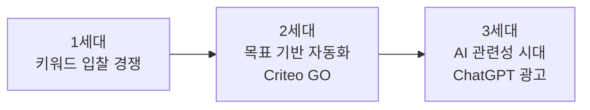
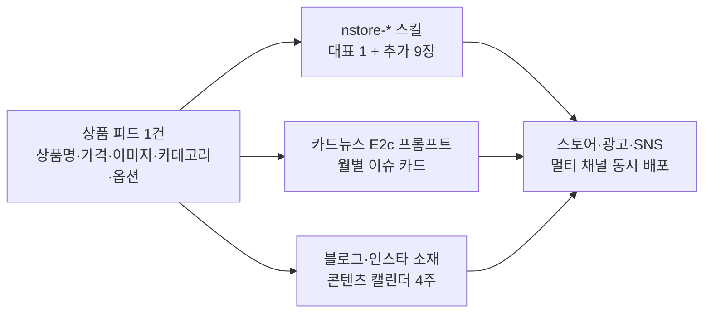

# 🤖 AI 시대 퍼포먼스 마케팅 — Criteo GO·ChatGPT 광고에서 베껴온 것들

> **작성일**: 2026-08-20
> **출처**: Criteo 서비스 제안서 2종 분석 — ① **GO Campaign**(AI 자동 최적화 캠페인) ② **Criteo × OpenAI**(ChatGPT 내 쇼핑 광고)
> **관점**: 우리는 광고 플랫폼 기업이 아니라 **스마트스토어 셀러 + 교육과정** — 기술 스택이 아니라 **운영 프레임워크·전략**을 베껴와 3개 브랜드(하이피부·치마·원피스)와 커리큘럼에 적용한다
> **관련**: `marketing/launch-playbook.md` · `marketing/highskin-channel-strategy.md` · `marketing/visual-branding-channel-results.md`

---

## 0. 한눈 요약 — 광고 패러다임 3단 전환



| 세대 | 승부처 | 소상공인에게 |
|---|---|---|
| 키워드 입찰 (SA 중심) | 입찰가 · 키워드 선정 | 자본력 싸움 — 불리 |
| 목표 기반 자동화 (GO) | **목표 설정 능력 · 데이터(태그)** | 자동화가 격차를 좁혀줌 — 유리 |
| AI 관련성 (ChatGPT 광고) | **제품 피드 품질 · 콘텐츠** | 입찰가가 아니라 정보 품질 경쟁 — 가장 유리 |

> **핵심 결론**: 갈수록 "얼마를 쓰느냐"가 아니라 **"내 상품 정보를 얼마나 잘 정리해 두었느냐"**가 광고 효율을 결정한다. 1인 셀러에게 유리해지는 구조 — 그래서 지금 준비할 가치가 있다.

---

## 1. 출처 서비스 요약 (무엇을 분석했나)

### 1.1. Criteo GO Campaign — AI 자동 최적화
- **정의**: 광고주가 목표(전환·신규고객)와 예산만 정하면 AI가 입찰·타겟팅·크리에이티브·채널을 자동 최적화하는 완전 자동화 퍼포먼스 솔루션
- **철학**: **"3단계 · 5클릭 · 10분"** 온보딩 — 복잡한 설정이 아닌 명확한 목표 설정에 집중
- **운영 모델**: **GO(상시 Always-On 자동화) + Custom(시즌·프로모션 수동 부스터)** 하이브리드
- **성과 사례**: CPA −62% 개선, 채널 통합 시 CTR +24% · ROAS +10%, META 연동 시 ROAS +20%

### 1.2. Criteo × OpenAI — 대화형(Conversational) 광고
- **정의**: ChatGPT 검색 답변(Organic) 옆에 스폰서 제품 광고(이미지·타이틀·설명)를 노출 — AI 어시스턴트가 새로운 광고 채널이 됨
- **작동 방식**: 제품 피드(최대 5만 개)를 전송 → 사용자 자연어 쿼리("가성비 좋은 프라이팬 추천해줘")에 OpenAI가 **관련성 기반**으로 실시간 제품 선정
- **핵심 제약**: 경쟁 입찰이 아님(동적 CPM, 입찰가 조정 불가) · **OpenAI가 노출 가중치 100% 통제** · 금지 업종 존재(데이팅·건강·금융·정치·주류)

---

## 2. 베껴올 것 10가지 (우선순위 순)

### ✅ A. 즉시 베낄 것 — 광고 운영 프레임워크 (GO Campaign)

| # | Criteo 원본 | 우리 적용 형태 | 적용 위치 |
|---|---|---|---|
| 1 | **목표 기반 최적화 4종** (BVO/BCO/ACO/ARO) | 광고 시작 전 "목표 하나"를 먼저 정하는 설계 순서 + 네이버 쇼핑광고 목표 매핑표 (§3) | `launch-playbook` §4 |
| 2 | **GO(상시) + Custom(시즌) 하이브리드** | 평시 = 소액 상시 자동화(Always-On) / 시즌 = 수동 정밀 부스터 → 마케팅 캘린더에 이원화 | 월별 이슈 캘린더 `priority` 컬럼 |
| 3 | **순차 테스트** (수동 4주 → 자동 4주, 동일 예산·목표) | "광고 3일 해보고 끔" 방지용 최소 검증 프로토콜 (§4.3) | `launch-playbook` §4 |
| 4 | **램프업(학습) 2~10일** | 알고리즘 학습기간에는 성급한 판단·수정 금지 — 첫 주 성과로 끊지 않는다 | §4.2 |
| 5 | **"3단계·5클릭·10분" 온보딩 철학** | ①목표·예산 → ②콘텐츠(자동 생성) → ③런칭 — 3단 체크리스트로 표준화 | §4.1 |
| 6 | **크리에이티브 자동화** (피드 → 멀티포맷 생성) | 상품 피드(상품명·가격·이미지·카테고리) 하나로 대표/추가이미지·카드뉴스·블로그 배너로 파생 — 이미 보유한 AI 이미지 스킬(nstore-*·카드뉴스 E2c)이 곧 자체 크리에이티브 엔진 | §6 |

### ✅ B. AI 검색 시대 대비 — 제품 정보 최적화 (Criteo × OpenAI)

| # | 인사이트 | 우리 적용 형태 | 적용 위치 |
|---|---|---|---|
| 7 | **경쟁 입찰 없음 = 관련성 기반 노출** → 입찰가가 아니라 **제품 피드 품질**(상품명·설명·카테고리 메타데이터)이 승부처 | "AI에게 추천받는 상품 정보" 체크리스트 — GEO(생성형 엔진 최적화) 관점 상품명 재정의 (§5) | `launch-playbook` §2 |
| 8 | **유기적 결과 vs 스폰서 분리** 구조 | 블로그·인스타(유기적) + 쇼핑광고(스폰서) 이원화 → 채널 퍼널에 'AI 어시스턴트' 채널 추가 | `highskin-channel-strategy` §2·§3 |
| 9 | **소규모 테스트 → 확장** (브랜딩형·상품세트형 소액 시작) | 새 채널·새 광고 유형은 반드시 소액 테스트 후 확대 — 손실 한도를 먼저 정한다 | §4.4 |
| 10 | **플랫폼 전환추적 미제공 → 자체 UTM 태깅** | 모든 유입 링크(광고·카드뉴스·블로그·인스타)에 UTM 규칙 표준화 — 지금 안 만들면 영영 측정 불가 (§7) | KPI 대시보드 |

### ❌ 안 베낄 것 (명시적 제외)
- **Kafka/Flink 데이터 레이크 · 강화학습 입찰 알고리즘 · DSP 통합 바잉 · 경매 시스템 개발** — 원본 문서의 카피 로드맵(Phase 1~3)은 광고기술 기업용 인프라. 1인 셀러·교육과정 규모에서는 불필요하며, 교육 시 "이런 인프라 위에서 돌아간다"는 그림 설명 수준으로만 활용한다.
- Criteo의 독점 커머스 데이터(전 세계 쇼핑 행동 데이터) — 확보 불가능하므로 벤치마크 대상이 아니라 **"그들이 데이터를 쓰는 방식"(타겟팅 로직)만** 참고한다.

---

## 3. 목표 기반 최적화 → 네이버 쇼핑광고 매핑표

Criteo의 입찰 최적화 4종은 네이버 광고의 최적화 목표 설정과 구조가 같다. **광고 만들기 화면을 열기 전에 이 표에서 한 줄을 먼저 고른다.**

| Criteo | 의미 | 네이버 쇼핑광고 목표 | 언제 고르나 | 판단 지표 |
|---|---|---|---|---|
| **BVO** (Visit) | 예산 내 최대 방문자 | 클릭 최적화 (CPC) | 스토어 신생·리뷰 0~20건 | 방문수 · CTR · 체류시간 |
| **BCO** (Conversion) | 예산 내 최대 전환 | 전환(구매) 최적화 | 전환 데이터 쌓이기 시작 | 전환수 · CVR |
| **ACO** (tCPA) | 목표 CPA 달성 | 목표 CPC/CPA 관리형 | 원가 구조 확인된 후 | CPA ≤ 목표치 |
| **ARO** (tROAS) | 목표 ROAS 달성 | 목표 ROAS 관리형 | 마진율 기준 지출 한도 산출 후 | ROAS ≥ 손익분기 |

> **순서 원칙 (하이피부 예시)**: 첫 달 BVO(방문) → 리뷰 20건 + 전환 데이터 축적 → BCO(전환) → 마진율 55% 확정 후 ARO(ROAS). **목표를 건너뛰면 알고리즘이 학습할 신호가 없다.**

---

## 4. 광고 운영 프로토콜 (GO 운영 전략 → 셀러 버전)

### 4.1. 3단 셋업 체크리스트 ("3단계·10분" 베끼기)

- [ ] **① 목표·예산** — §3 표에서 목표 1개 선택 + 일 예산·손실 한도 확정 (일 1만원 시작)
- [ ] **② 콘텐츠** — 상품 피드 기반 자동 생성: 대표·추가이미지(nstore-* 스킬) + 카드뉴스(E2c 프롬프트) + 광고 문구(상품명 공식 재사용)
- [ ] **③ 런칭 + 추적** — UTM 붙여서 발행 (§7) → **런칭 직후가 아니라 1주일 뒤에 첫 진단**

### 4.2. 학습기간(램프업) 규칙 — "2~10일은 참는다"

| 기간 | 하면 되는 것 | 하지 말 것 |
|---|---|---|
| D0~D3 | 데이터 수집만 | 예산 변경·중단 ❌ (학습 리셋됨) |
| D4~D10 | 노출·클릭 흐름 확인 | 키워드 대폭 수정 ❌ |
| D11~ | 첫 진단 — §3 판단 지표로 | 여기서부터 수정·확장 ✅ |

### 4.3. 순차 테스트 — 수동 vs 자동 4+4주

Criteo 권장: 동일 예산·목표로 **수동(Custom) 4주 → 자동(GO) 4주** 순차 비교. 네이버 버전:

| 주차 | 모드 | 운영 | 기록 지표 (주 1회) |
|---|---|---|---|
| 1~4주 | 수동 | 키워드 직접 선정·입찰가 조정 | CTR · CPC · 전환수 · ROAS |
| 5~8주 | 자동 | 스마트 자동화 상품으로 전환, 동일 예산·목표 | 동일 지표 |
| 8주 후 | 판정 | CPA/ROAS 우위 모드를 **Always-On 베이스**로 채택 | — |

> **주의**: 두 모드를 동시에 돌리면 예산 분산으로 비교가 무의미해진다 — 반드시 기간 분리(순차). Criteo 사례에서는 자동화 전환 시 CPA −62%.

### 4.4. Always-On + 시즌 부스터 하이브리드

- **Always-On 베이스**: 월별 이슈 캘린더에서 `priority`가 Mid/Low인 달 — 소액 자동화 상시 운영, 손대지 않음
- **부스터**: `priority = High` 달(설 · 가정의달 · 여름휴가 · 추석 · 연말) — 예산 상향 + 수동 정밀 타겟팅 + 시즌 크리에이티브(월별 카드뉴스 E2c)
- 시즌 종료 후 반드시 **베이스 예산으로 복귀** (올린 채 방치가 지출 누수 1위)

---

## 5. AI 검색 시대 대비 — GEO 체크리스트 (상품 피드 품질)

ChatGPT 광고는 경쟁 입찰이 아니므로 **가격 전략이 아니라 피드 최적화·프롬프트(콘텐츠) 품질에 투자**해야 한다 (Criteo 문서 결론과 동일). = 네이버 AI쇼핑·ChatGPT 제품 추천 시대의 **상품명·상세정보 규칙**:

- [ ] **상품명에 "누가·언제·무엇에" 녹이기** — "하이피부 아이 물병샴푸바" ❌ → "하이피부 키즈 여행용 고체 샴푸바 50g" ⭕ (AI가 쿼리 매칭할 메타데이터)
- [ ] **카테고리 정확성** — AI 추천의 1차 필터. 유사 카테고리에 걸쳐 있으면 대표 카테고리 1개로 확정
- [ ] **속성(옵션) 전부 입력** — 용량·사이즈·향·소재 = AI가 "상황에 맞는 상품"을 고르는 근거
- [ ] **상세설명 첫 3문장에 핵심 정보** — 사용 상황·타겟·차별점. AI는 요약해서 답하므로 앞부분이 답변에 들어간다
- [ ] **후기 키워드 관리** — AI 추천 근거에 리뷰가 쓰인다 ("민감피부 아이도 괜찮았어요" 같은 문장이 그대로 근거가 됨)
- [ ] **셀프 테스트**: ChatGPT에 "민감피부 아이 샴푸바 추천줘"라고 물어보고 내 상품이 언급되는지 분기 1회 점검

---

## 6. 크리에이티브 자동화 — 우리의 "자체 GO 엔진"

Criteo는 제품 피드만 넣으면 디스플레이·비디오·네이티브 광고를 자동 생성한다. 우리 버전은 **이미 갖춰진 스킬 체인**이다:



> 원칙: **상품 정보(피드)를 한 번 잘 정리하면 모든 채널 소재가 파생된다.** 반대로 피드가 부정확하면 모든 채널이 함께 틀어진다.

---

## 7. UTM 태깅 표준 — 자체 전환 추적 체계

ChatGPT 광고는 플랫폼 내 전환 추적이 없어 **자체 UTM + 애널리틱스**로 측정한다 (Criteo 광고주 가이드와 동일). 우리도 동일 규칙을 모든 링크에 적용:

| 채널 | utm_source | utm_medium | utm_campaign 예시 |
|---|---|---|---|
| 네이버 쇼핑광고 | naver | cpc | `2026-09_chuseok_booster` |
| 인스타 바이오/스토리 | instagram | social | `picker-quiz_2026q3` |
| 블로그 CTA | blog | content | `minsguide_2026-08` |
| 카드뉴스 | cardnews | social | `cardnews_feb_seollal` |

> 규칙: `utm_campaign = 연도-월_테마_모드(always-on/booster)` — 캘린더 priority와 대조하면 어느 달의 광고가 먹혔는지 즉시 구분된다.

---

## 8. 3개 브랜드 적용 시나리오

| 브랜드 | 목표 경로 (§3) | Always-On / 부스터 달 | AI 채널 대비 (§5) |
|---|---|---|---|
| **하이피부** (바디바·온가족) | BVO(리뷰 적립기) → BCO → ARO | 베이스 상시 + 부스터: 설·가정의달·추석(선물세트) | "민감피부 아이 샴푸바" 상황형 쿼리 선점 — 속성(연령·피부타입·용량) 입력 필수 |
| **치마** (스커트·19~45세) | BVO → ACO(원가 확인 빠름) | 부스터: 3월 새학기·취준(11월)·하객(5·9월) | "면접 치마""하객룩 치마" 상황×체형 키워드 — 사이즈 속성 정확도가 승부처 |
| **원피스** (40·50대·사이즈프리) | BVO → BCO(객단가 높음) | 부스터: 4월 벚꽃·6~8월 휴양지(핵심) | "50대 하객 원피스""빅사이즈 휴양지 원피스" — 연령·사이즈 메타데이터 |

---

## 9. 커리큘럼 단원 매핑 (교육 적용)

| 커리큘럼 단원 | 이 문서에서 가져갈 것 |
|---|---|
| **15. 상품명 만들기 · 16. 상품명 진단 · 17. 키워드 선정** | §5 GEO 체크리스트 — "AI에게 추천받는 상품명" 관점 추가 |
| **33. 스마트스토어 광고** | §3 목표 매핑표 · §4 운영 프로토콜 — 본 문서가 핵심 보조자료 |
| **34. 마케팅 캘린더** | §4.4 Always-On + 부스터 이원 구조 — 월별 priority와 연결 |
| 13. AI 상세페이지 제작 | §6 크리에이티브 자동화 — 상품 피드 → 소재 파생 파이프라인 |
| 25~26. 인스타·카드뉴스 | 부록 카드뉴스 프롬프트로 "AI 시대 광고" 수강생 안내카드 제작 |

---

## 부록 — 수강생용 카드뉴스 프롬프트 (ChatGPT 붙여넣기 · E2c 형식)

> **용도**: "광고는 이제 AI가 한다" 교육용 안내카드 1장 — 별도 ChatGPT에 붙여넣어 생성. 결과물은 `to-webp.py`로 경량화 후 `static/img/class-0807/cardnews/` 에 적재

```text
당신은 디지털 셀러 교육과정의 카드뉴스 디자이너입니다. 아래 지시를 정확히 따라 인스타그램 교육용 카드뉴스 이미지 1장을 생성해주세요.

■ 스타일 (교육 공통)
- 대상: 스마트스토어 창업 교육 수강생 (성인)
- 색상: 크림 #FFF8EF(배경) · 네이비 #1B3A5C(제목·강조) · 소프트 핑크 #F6A6B8(포인트) · 딥 브라운 #403735(본문 텍스트)
- 그림체: 깔끔한 손그림 아이콘 + 플랫 인포그래픽. 네온·3D·실사 금지
- 텍스트: 한글 간결, 굵은 제목 위주 (텍스트가 깨지면 문구 최소화)

■ 카드 레이아웃 (4:5 세로, 1080×1350)
- 상단 배지: 【"광고 트렌드 2026"】
- 중앙 대제목: 【"광고는 이제 AI가 한다"】
- 중앙 3단 요약 (아이콘 + 한 줄씩):
  ① 【목표만 정하면 알고리즘이 최적화】
  ② 【입찰가 대신 상품정보 품질이 승부】
  ③ 【지금 준비할 것: 상품명·카테고리·후기】
- 하단: 【"첫 주 성과에 조급하지 않기 — AI는 2~10일 학습"】 + #스마트스토어 #AI마케팅

위 내용으로 카드뉴스 이미지 1장을 생성해주세요.
```

---

## 연관 문서
- 실행: `marketing/launch-playbook.md` (§2 GEO · §4 광고 운영 반영) · `marketing/highskin-channel-strategy.md` (AI 채널·하이브리드 반영)
- 캘린더: `marketing/visual-branding-channel-results.md` (Always-On + 부스터 운영 모델)
- 원본 Criteo 분석 문서: 커리큘럼 참고자료 (붙여넣은 제안서 분석, 2026-08-20)
