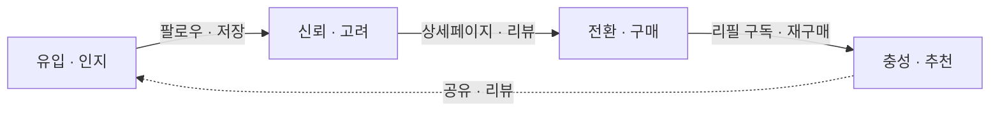
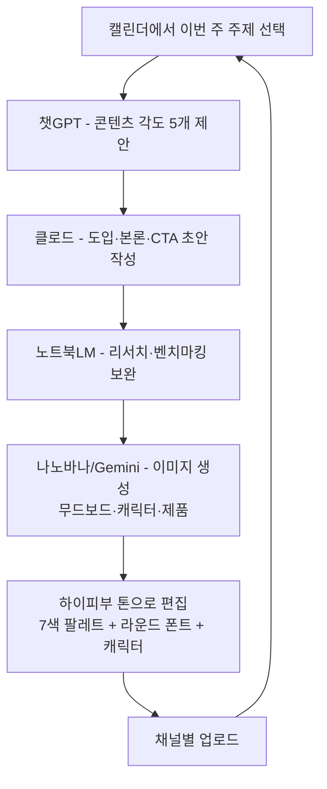

import CsvTable from '@site/src/components/CsvTable';

# 하이피부(HIGHSKIN) 채널 & 콘텐츠 전략

> **작성일**: 2026-08-09
> **기준선**: 비주얼 가이드라인 Recap (7가지) → 채널 전략(모듈 C) → 콘텐츠 전략(모듈 D)
> **브랜드**: 하이피부 — Happy Natural Care · Cute × Nature × Family · 7색 팔레트(크림50 · 소프트핑크20 · 밀크핑크 · 세이지 · 애프리콧 · 리프그린 · 딥브라운)
> **관련**: `branding/bodybar-color-palette.md` · `branding/moodboard-prompt-guide.md` · `branding/highskin-product-ideas.md` · `branding/highskin-picker-quiz.md`

---

## 0. Recap — 나의 비주얼 가이드라인 셀프 체크 (하이피부 완성도)

| 항목 | 확인 질문 | 하이피부 완성도 |
|---|---|---|
| 브랜드 미션 | 한 문장으로 설명 가능한가? | ✅ "가족의 일상에 즐거운 목욕 습관을 만드는 브랜드" |
| 핵심가치 | 3~5개가 구체적으로 적혀 있는가? | ✅ 즐거움 · 안심 · 자연 · 지속가능(리필) · 포용(온가족) |
| 퍼스낼리티 | 형용사 3개 이상으로 표현되어 있는가? | ✅ 귀엽고 · 포근하고 · 순하고 · 장난기 있는 |
| 컬러팔레트 | 메인/서브/포인트가 정해져 있는가? | ✅ 소프트 핑크(메인) · 세이지/리프그린(자연) · 크림(배경) · 딥브라운(텍스트) |
| 타이포그래피 | 제목/본문 서체가 결정되어 있는가? | ✅ 라운드 산세리프 중심 + 손글씨 로고 방향 (무드보드 09) |
| 톤앤매너 & 무드보드 | 레퍼런스 이미지가 수집되어 있는가? | ✅ 하이피부 무드보드 + Pinterest 표정 보드 22핀 |
| 로고 방향 | 형태/색상이 결정되어 있는가? | ✅ 표정 콜라주 로고(A/B 프롬프트) — 부록 A |

> **결론**: 7가지 기준이 확정됨 → 이제 이 기준으로 채널·콘텐츠를 일관되게 운영합니다.

---

## 1. 채널 생태계 (OWNED / EARNED / PAID)

| 유형 | 하이피부 채널 | 역할 |
|---|---|---|
| **OWNED** | 스마트스토어 · 인스타그램 계정 · 네이버 블로그 | 장기 자산 — 무드보드·캐릭터·리필 시스템을 직접 운영 |
| **EARNED** | 네이버 쇼핑 리뷰 · SNS 태그 · 지인 추천 · 픽커 퀴즈 공유 | 신뢰의 원천 — "내 하이피부 친구" 공유로 입소문 |
| **PAID** | 인스타/네이버 쇼핑 광고 · 인플루언서 협찬 | 특정 시점 부스팅 (리필 구독 캠페인·여름 휴양 시즌) |

> **원칙**: OWNED로 기반 → EARNED로 신뢰 → 필요할 때 PAID로 부스팅. 초기엔 PAID 비중 최소화.

## 2. 채널-타겟 매칭 (페르소나: 30~40대 엄마 · 온가족 케어)

| 채널 | 타겟이 쓰는 이유 | 하이피부 적합도 | 우선순위 |
|---|---|---|---|
| **인스타그램** | 육아·리빙 감성 탐색, 비주얼로 브랜드 발견 | 높음 (캐릭터·무드보드 최적) | **주력** |
| **네이버 블로그** | "민감피부 바디바/샴푸바" 검색 리서치 | 높음 (검색 기반 신뢰) | **보조** |
| **스마트스토어** | 최종 구매 · 리뷰 확인 | 필수 (전환 채널) | 전환 |
| 유튜브/쇼츠 | 클린뷰티·리빙 롱폼 리서치 | 보통 | 향후 검토 |
| 틱톡 | 발견성 높은 숏폼 | 보통 | 향후 검토 |
## 3. 크로스채널 퍼널 — 유입 → 신뢰 → 전환

| 퍼널 단계 | 담당 채널 | 고객 상태 | 필요한 콘텐츠 |
|---|---|---|---|
| 1단계 유입(인지) | 인스타 릴스 · 픽커 퀴즈 공유 | 브랜드를 처음 만남 | 캐릭터 표정 릴스, "나만의 하이피부 친구" 퀴즈 |
| 2단계 신뢰(고려) | 네이버 블로그 · 인스타 피드 | 구매 전 리서치 중 | 민감피부 성분 가이드, 리필 시스템 설명, 리뷰 |
| 3단계 전환(구매) | 스마트스토어 | 구매 결정 직전 | 상세페이지(소재·사이즈) + 리뷰 + 픽커 결과 상품 연결 |
| 4단계 충성(재구매) | 정기구독 · DM | 리필 시점 | 리필 쿠폰, 새 향·한정판 안내 |

> **비주얼 가이드라인 일관 적용**: 모든 단계에서 7색 팔레트 + 손그림 캐릭터 + 라운드 폰트 유지 → "어느 채널에서 만나도 하이피부".

## 4. 알고리즘 노출 기초 (하이피부 적용)

| 플랫폼 | 핵심 신호 | 하이피부 전략 |
|---|---|---|
| **인스타그램** | 저장률 · 공유(DM) · 체류시간 · 댓글 반응 | "표정 고르기" 저장형 콘텐츠, 캐릭터 DM 공유 유도, 업로드 직후 30분 댓글 응대 |
| **유튜브(향후)** | CTR · 시청 지속 · 첫 24~48h 반응 · 키워드 | 썸네일에 캐릭터 얼굴, 제목에 "민감피부/리필" 키워드 |
| **네이버 블로그** | 검색 유입 · 체류 · 키워드 밀도 | "민감피부 바디바 · 샴푸브러시 · 여행용 비누 세트" 키워드 글 |

## 5. 콘텐츠 필러 (Content Pillar) — 하이피부 4유형

| 필러 | 비율 | 하이피부 콘텐츠 예시 |
|---|---|---|
| **정보성** | 40% | 민감피부 케어 루틴, 바디바 성분 가이드, 샴푸브러시 사용법, 여행용 미니 세트 꿀팁 |
| **브랜딩** | 25% | 캐릭터 탄생 스토리, 무드보드 비하인드, 리필·재생 소재 제조 과정 |
| **판매유도** | 20% | 리필 구독 소개, 여행 세트 런칭, 픽커 퀴즈 → 추천 상품 연결 |
| **참여형** | 15% | **픽커 퀴즈(눈·코·입 고르기)**, 표정 투표, 하이피부 친구 이름 짓기 이벤트 |

> 픽커 퀴즈는 **참여형 + 전환**의 이중 기능 — 재미로 참여시켜 피부타입·향 데이터를 얻고 추천 상품으로 연결하는 퍼널 심장부.

## 6. 4주 콘텐츠 캘린더
> 📥 [하이피부 4주 콘텐츠 캘린더 CSV](/data/marketing-calendar/4week_content_highskin.csv)
<CsvTable src="/data/marketing-calendar/4week_content_highskin.csv" caption="🗓 하이피부 4주 콘텐츠 캘린더 (실시간)" />
- **주별 요약**: 1주(브랜딩·참여) → 2주(정보·참여·판매) → 3주(브랜딩·정보·판매) → 4주(판매·참여·브랜딩)
- **필러 배분**: 브랜딩 3 · 정보 3 · 참여 3 · 판매 3 (균형)

## 7. 포맷 표준화 (하이피부 템플릿)

- **릴스**: 도입(0~3초 "민감피부, 샴푸바?") → 본론(성분/시연/표정) → CTA(저장/픽커 퀴즈 링크) + 핑크 자막·라운드 폰트·부드러운 BGM
- **런칭 릴스**: 브랜딩 런칭 알림용 15초 스토리보드·영상 생성 프롬프트는 `moodboard-prompt-guide.md` **부록 F** (Veo 3 · Sora · Kling)
- **블로그**: 도입(키워드+공감) → 본론 3~5섹션(성분·사용법·리뷰) → CTA(스토어 링크) + 크림 배경 대표 이미지
- **상세페이지**: 공감(타겟 문제) → 소재·디테일·사진 → 리뷰 → 구매 버튼 반복 + 하이피부 무드 배경·폰트

---

**리소스 체크**: 1인 운영 전제 — 주력 1(인스타) + 보조 1(블로그)로 최소화. 주 3회 인스타(릴스 2+피드 1), 주 1회 블로그.

## 8. AI 툴 통합 워크플로우 (하이피부 콘텐츠 제작)

| 단계 | 도구 | 역할 | 주의 |
|---|---|---|---|
| 1 | 챗GPT | 주제 → 각도 5개 브레인스토밍 | 톤 적용 전 단계 |
| 2 | 클로드 | 도입-본론-CTA 초안 (하이피부 톤 지시) | 초안은 참고용 |
| 3 | 노트북LM | 자료·벤치마킹·사실 검증 보완 | **사실은 직접 검증** |
| 4 | 나노바나 | 무드보드·캐릭터 표정·제품 사진 생성 | 프롬프트는 `moodboard-prompt-guide.md` 부록 활용 |
| 5 | 브랜드 편집 | AI 초안에 경험·스토리 추가, 7색/폰트 적용 | "AI 냄새" 제거 |

## 9. AI 모델 · 이미지 생성 통합 FAQ

### ChatGPT Plus → API / CLI 사용 가능한가?
- **가능**합니다. 단, ChatGPT Plus 구독비와 **별도로** `platform.openai.com`에서 API 키를 발급받고 **종량제(사용량만큼 결제)**로 사용합니다. Plus 구독만으로는 API 크레딧이 주어지지 않습니다.
- CLI 도구(`openai` 패키지, `aider` 등)도 API 키만 있으면 사용 가능하며, 이미지 생성은 **gpt-image-1**(OpenAI 이미지 API)로 호출할 수 있습니다.

### GLM(지능형) · DeepSeek도 API/CLI로 쓸 수 있나?
- **GLM 시리즈**(Zhipu AI)와 **DeepSeek 시리즈**는 모두 공식 API를 제공하고, 오픈소스 모델은 로컬 실행(CLI)도 가능합니다. `OpenRouter` 같은 라우터로 통합 호출도 가능합니다.
- ⚠️ 언급하신 **GLM-5.2 · DeepSeek V4 Flash**는 현재 공식 모델명으로 확인되지 않습니다. 실제 제공 모델명은 각사 API 문서(공식 사이트)에서 확인 후 사용하세요.

### "통합 워크플로우로 이미지 생성을 한 번에 처리"?
- 가능합니다. 아래처럼 **오케스트레이션 스크립트**로 연결하면 한 번에 처리됩니다:
  - 텍스트(챗GPT/클로드/GLM/DeepSeek 중 택1) → 주제·각도 생성
  - 이미지(나노바나=Gemini 2.5 Flash Image API, 또는 OpenAI gpt-image-1) → 무드보드/캐릭터/제품 생성
  - 결과물을 KB 폴더로 저장 → 이후 문서·스모어·스토어에 자동 반영
- 나노바나 이미지 생성은 **Gemini API**(`images.generate` 계열) 또는 **Google AI Studio**에서 가능합니다.

---

## 10. 세션 전체 흐름 정리 (수업 Recap → 하이피부 적용)

1. **브랜드 기준 확립** — 비주얼 가이드라인 7가지(미션·가치·퍼스낼리티·컬러·타이포·톤앤매너·로고)를 하이피부로 완성
2. **채널 생태계** — OWNED/PAID/EARNED 구분, 주력(인스타)·보조(블로그)·전환(스토어) 결정
3. **크로스채널 퍼널** — 유입→신뢰→전환(→충성) 설계, 단계별 담당 채널·콘텐츠 지정
4. **콘텐츠 캘린더** — 필러 4유형(40/25/20/15) 배분 + 4주 실행 계획 수립
5. **AI 워크플로우** — 챗GPT→클로드→노트북LM→나노바나→브랜드 편집으로 제작 파이프라인 구성

## 연관 문서
- 브랜드 기준: `branding/bodybar-color-palette.md` · `branding/moodboard-prompt-guide.md` · `branding/brand-identity-curriculum.md`
- 제품·퀴즈: `branding/highskin-product-ideas.md` · `branding/highskin-picker-quiz.md`
- 실행: `research/launch-playbook.md`(→ `marketing/launch-playbook.md`) · `research/execution-plan.md`
---