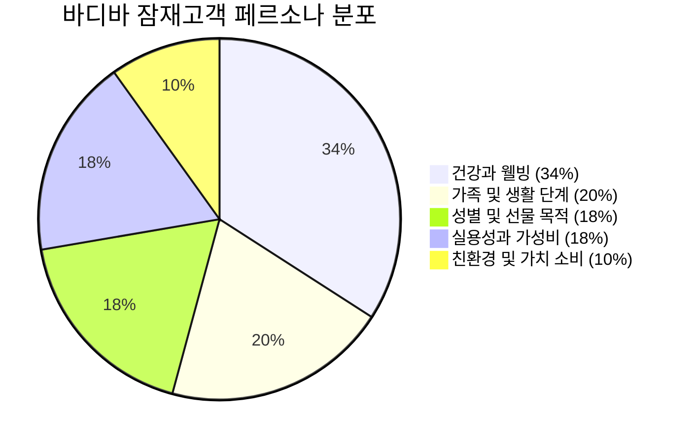
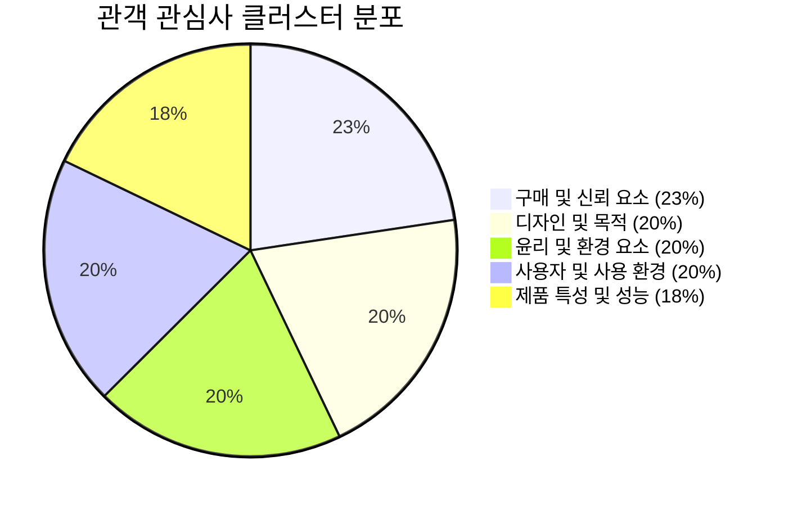
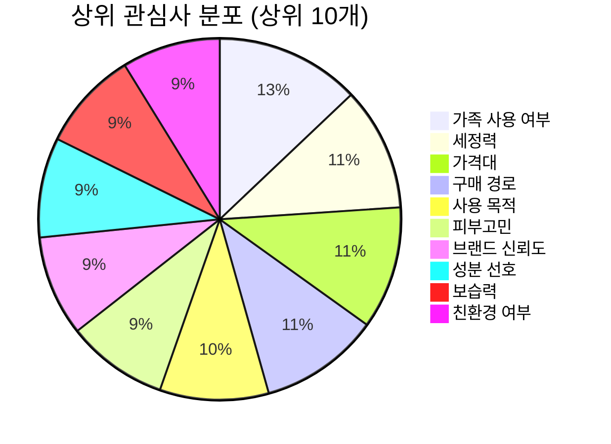
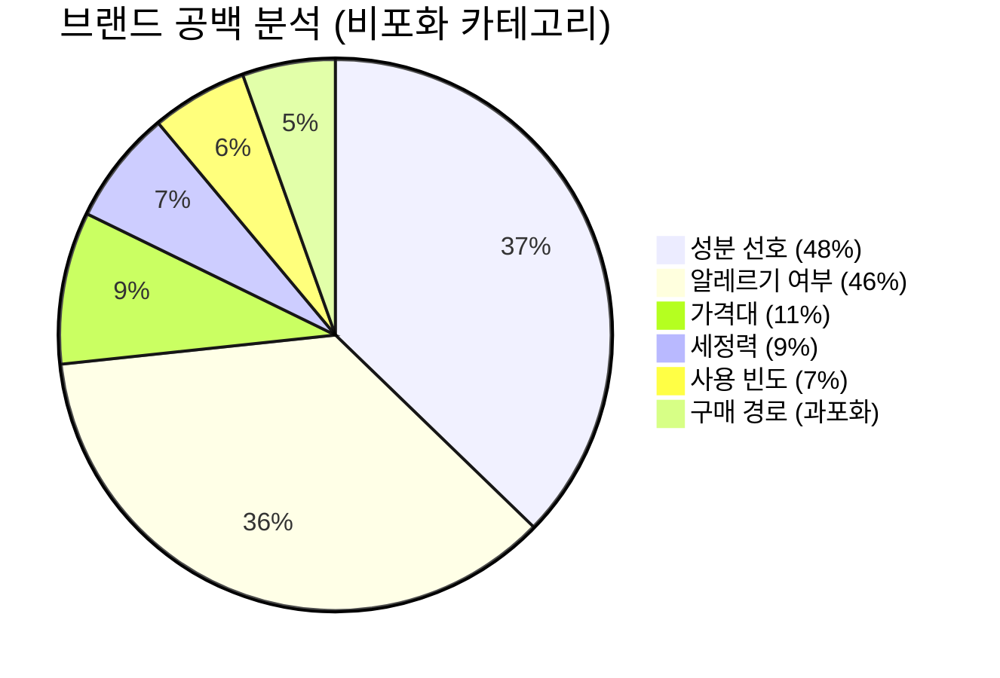

# 바디바(샴푸바) 잠재고객 분석

> 출처: OneInsight 잠재고객 분석 대시보드
> 분석 대상: 바디바 구매에 관심 있는 잠재고객
> 전체 시장 규모: **6,213,600명**

---

## 경영진 요약

바디바 구매에 관심 있는 잠재고객은 **건강과 웰빙을 최우선**으로 생각하며, **실용성과 가성비** 또한 중요하게 여기는 경향이 있습니다. 이들은 가족의 필요를 고려하고 있으며, 환경 친화적인 가치에도 관심을 기울이기도 합니다.

### 주요 통찰

1. **건강과 웰빙에 대한 강한 관심**: 소비자들은 건강과 웰빙을 중시하며, 이는 바디바 구매 결정에 가장 큰 영향을 미치는 요인
2. **가족 중심의 구매 성향**: 가족 구성원의 필요와 생활 단계에 맞춰 제품을 선택
3. **실용성과 가성비의 중요성**: 합리적인 소비를 선호하며 실속 있는 구매 추구
4. **성별 및 선물 목적 구매 고려**: 선물용으로 바디바를 구매하는 경향 존재

---

## 페르소나 세분화

### 1. 가족 및 생활 단계별 구매자

| 항목 | 내용 |
|------|------|
| **세그먼트 크기** | 1,248,322명 |
| **예상 연령대** | 30-65세 |
| **예상 성별 분포** | 남성 40% - 여성 60% |

**특징**: 가족과 함께하는 여행이나 일상에서 온 가족이 안심하고 사용할 수 있는 안전성과 피부 건강 중시. 아이부터 어른까지 모두 사용할 수 있는 제품 선호. 여행 시 간편한 휴대 실용성 중시.

**시장 세그먼트 구성**:
- 신혼부부 39.67%
- 노년층 37.90%
- 자녀를 둔 부모 11.93%
- 중장년층 10.50%

**주요 관심사 TOP 10**:
1. 브랜드 신뢰도 (12.02%)
2. 사용 빈도 (7.53%)
3. 추천 및 후기 (6.81%)
4. 동물실험 여부 (6.63%)
5. 세정력 (5.97%)
6. 사용 목적 (5.94%)
7. 유통기한 (5.25%)
8. 가격대 (5.16%)
9. 패키지 디자인 (5.10%)

**주요 토픽**:
- 거품 망 포함 디자인 (66.73%)
- 가족 여행 필수품 (59.98%)
- 여행 시 편리함 (50.69%)
- 스트레스 해소 도움 (50.23%)
- 아이에게 안전한 제품 (44.90%)

---

### 2. 건강과 웰빙을 중시하는 소비자

| 항목 | 내용 |
|------|------|
| **세그먼트 크기** | 2,119,348명 (가장 큰 세그먼트) |
| **예상 연령대** | 25-40세 |
| **예상 성별 분포** | 남성 20% - 여성 80% |

**특징**: 매일의 샤워 루틴에서 온 가족이 함께 사용할 수 있는 순하고 효과적인 제품 선호. 피부가 민감하거나 알레르기 체질인 경우에도 안심하고 사용할 수 있는 성분 중시. 딥 클렌징 효과로 피부 트러블 예방.

**시장 세그먼트 구성**:
- 운동 애호가 30.50%
- 알레르기 체질 성인 26.33%
- 임산부 15.12%
- 건강 및 웰빙 관심자 11.99%
- 피부 민감성 성인 10.87%
- 피부 관리 관심자 5.19%

**주요 관심사 TOP 10**:
1. 향 선호 (7.64%)
2. 성분 선호 (6.99%)
3. 보습력 (6.77%)
4. 추천 및 후기 (6.59%)
5. 사용 목적 (6.32%)
6. 피부고민 (6.23%)
7. 가족 사용 여부 (6.07%)
5. 가격대 (5.94%)
9. 구매 경로 (5.34%)
10. 세정력 (5.17%)

**주요 토픽**:
- 매일 사용 목표 (42.17%)
- 클렌징 바 특가 (41.57%)
- 샤워 후 뽀득거림 (39.98%)
- 온 가족 다 사용할 수 있어요 (38.56%)
- 딥 클렌징 효과 (36.18%)

---

### 3. 성별 및 선물 목적 구매자

| 항목 | 내용 |
|------|------|
| **세그먼트 크기** | 1,122,931명 |
| **예상 연령대** | 25-45세 |
| **예상 성별 분포** | 남성 50% - 여성 50% |

**특징**: 피부 건강과 고급스러운 라이프스타일 중시. 백화점 브랜드와 친구 추천 참고하여 선물용 제품 찾음. 계절 변화에 맞춰 촉촉한 피부 유지. 위메프 특가와 휴대 간편한 크기, 면도 후 피부 트러블 예방 등 실용성과 품질 모두 고려.

**시장 세그먼트 구성**:
- 고급 제품 선호자 34.91%
- 선물용 제품 구매자 32.75%
- 남성 성인 26.24%
- 여성 성인 6.10%

**주요 관심사 TOP 10**:
1. 피부고민 (9.89%)
2. 보습력 (7.78%)
3. 세정력 (5.93%)
4. 제품 용량 (5.90%)
5. 동물실험 여부 (5.73%)
6. 패키지 디자인 (5.45%)
7. 가족 사용 여부 (5.41%)
4. 브랜드 신뢰도 (5.36%)
9. 구매 경로 (5.35%)
10. 가격대 (5.27%)

**주요 토픽**:
- 백화점 브랜드 가격 (66.95%)
- 휴대 편리한 크기 (53.48%)
- 위메프 오 구매 (37.36%)
- 면도 후 피부 트러블 (32.80%)
- Leaping bunny 로고 (32.39%)

---

### 4. 실용성과 가성비를 중시하는 소비자

| 항목 | 내용 |
|------|------|
| **세그먼트 크기** | 1,106,326명 |
| **예상 연령대** | 20-35세 |
| **예상 성별 분포** | 남성 40% - 여성 60% |

**특징**: 온라인에서 다양한 제품의 가격과 품질을 꼼꼼히 비교해 최적의 선택 추구. 자취나 바쁜 직장 생활, 대학 생활 속에서 합리적인 소비 실천. 선물용이나 본인 사용 모두에서 만족도 중시. 피부 타입에 맞는 제품이나 환경을 고려한 선택에도 관심.

**시장 세그먼트 구성**:
- 자취생 33.81%
- 대학생 25.03%
- 직장인 22.24%
- 가성비 중시 소비자 18.92%

**주요 관심사 TOP 10**:
1. 동물실험 여부 (12.08%)
2. 친환경 여부 (10.04%)
3. 성분 선호 (9.50%)
4. 세정력 (8.92%)
5. 브랜드 신뢰도 (7.82%)
6. 가족 사용 여부 (6.83%)
7. 유통기한 (6.45%)
8. 추천 및 후기 (5.47%)
9. 구매 경로 (5.31%)
10. 가격대 (4.77%)

**주요 토픽**:
- 가격 대비 만족도 (64.07%)
- 온라인 최저가 검색 (54.48%)
- 가성비 좋은 제품 (53.74%)
- 선물용으로 정말 좋아요 (44.41%)
- 백화점 브랜드 가격 (38.90%)

---

### 5. 친환경 및 가치 소비자

| 항목 | 내용 |
|------|------|
| **세그먼트 크기** | 616,673명 |
| **예상 연령대** | 25-40세 |
| **예상 성별 분포** | 남성 20% - 여성 80% |

**특징**: 일상에서 환경을 생각하는 소비를 실천. 동물성 원료를 배제하고, 재활용 가능한 용기와 업사이클링 포장재를 사용하는 브랜드 선호. 제로 웨이스트와 지속가능성 중시. 착한 기업의 제품 선택. 글루텐 프리 등 건강과 가치 소비를 동시에 추구.

**시장 세그먼트 구성**:
- 친환경 제품 선호자 58.16%
- 비건 라이프스타일 추구자 41.84%

**주요 관심사 TOP 10**:
1. 사용 빈도 (12.24%)
2. 알레르기 여부 (10.00%)
3. 가족 사용 여부 (10.61%)
4. 계절별 사용 (7.32%)
5. 피부고민 (5.97%)
6. 브랜드 신뢰도 (5.80%)
7. 성분 선호 (5.68%)
8. 동물실험 여부 (4.63%)
9. 패키지 디자인 (4.60%)
10. 친환경 여부 (4.18%)

**주요 토픽**:
- 업사이클링 포장재 (73.81%)
- 동물성 원료 배제 (70.56%)
- 친환경적인 브랜드 선호 (70.25%)
- 재활용 가능한 용기 (69.65%)
- 제로 웨이스트 실천 (67.43%)

---

## 관심사 개요

| 클러스터 | 점유율 | 주요 내용 |
|----------|--------|-----------|
| **구매 및 신뢰 요소** | 22.63% | 가격대, 브랜드 신뢰도, 구매 경로, 추천과 후기 |
| **디자인 및 목적** | 20.27% | 시각적으로 매력적인 패키지 디자인, 사용 목적 부합 |
| **윤리 및 환경 요소** | 19.63% | 환경 보호, 윤리적 소비, 친환경, 비동물실험 제품 선호 |
| **사용자 및 사용 환경** | 19.62% | 피부 타입, 피부 고민, 가족 공유, 알레르기, 계절, 사용 빈도 |
| **제품 특성 및 성능** | 17.86% | 보습력, 세정력, 성분 선호, 향, 용량, 유통기한 |

---

## 관심사 분포 (상위 10개)

| 순위 | 관심사 | 비중 |
|------|--------|------|
| 1 | 가족 사용 여부 | 7.79% |
| 2 | 세정력 | 6.66% |
| 3 | 가격대 | 6.62% |
| 4 | 구매 경로 | 6.47% |
| 5 | 사용 목적 | 5.87% |
| 6 | 피부고민 | 5.46% |
| 7 | 브랜드 신뢰도 | 5.42% |
| 8 | 성분 선호 | 5.39% |
| 9 | 보습력 | 5.37% |
| 10 | 친환경 여부 | 5.30% |

---

## 브랜드 고려 사항

### 경쟁사 관련성 분석

| 브랜드 | 성분 선호 | 피부타입 | 사용 빈도 | 피부고민 | 가격대 | 친환경 |
|--------|-----------|----------|-----------|----------|--------|--------|
| 아모레퍼시픽 | 강한 | 보통 | 보통 | 보통 | 보통 | 거의 없음 |
| 헤라 | 강한 | 보통 | 보통 | 강한 | 강한 | 거의 없음 |
| 라운드랩 | 강한 | 강한 | 강한 | 보통 | 거의 없음 | 거의 없음 |
| 셀리맥스 | 강한 | 강한 | 강한 | 강한 | 거의 없음 | 관련 없음 |
| 더바디샵 | 강한 | 보통 | 거의 없음 | 거의 없음 | 보통 | 강한 |
| 톤28 | 보통 | 보통 | 보통 | 보통 | 거의 없음 | 강한 |
| 동구밭 | 강한 | 관련 없음 | 거의 없음 | 보통 | 거의 없음 | 강한 |
| 아로마티카 | 강한 | 거의 없음 | 보통 | 거의 없음 | 강한 | 강한 |

---

## 브랜드 공백 분석

### 비포화 카테고리 (기회 영역)

| 카테고리 | 비포화 정도 |
|----------|-------------|
| 성분 선호 | 47.61% |
| 알레르기 여부 | 46.09% |
| 가격대 | 11.40% |
| 세정력 | 8.56% |
| 사용 빈도 | 7.20% |

### 과포화 카테고리 (경쟁 치열)
- 구매 경로 (-6.95%)

---

## 채널 및 콘텐츠 참여도

### 앱 유형별 참여도

### 채널 세부 정보 - 인기 콘텐츠

**유튜브**:
- 아트 튜토리얼 (2.21x)
- 뷰티 팁 (1.99x)
- 게임 실시간 스트리밍 (1.61x)
- 뉴스 해설 (1.61x)
- 영화 엉터리 (1.52x)

**메타**:
- 패션 트렌드 (2.18x)
- 기술 (1.81x)
- 뷰티 팁 (1.64x)
- 애완동물 (1.56x)
- 가족의 시간 (1.53x)

**틱톡**:
- 랩 (2.16x)
- 자연 (1.84x)
- 동물 (1.67x)
- 스포츠 하이라이트 (1.60x)
- 학습 팁 (1.56x)

**TV**:
- 스트리밍 장치 (2.02x)
- 어린이 만화 (1.84x)
- 애니메이션 코미디 (1.66x)
- 판타지 드라마 (1.57x)
- 어린이 영화 (1.56x)

---

## 전략적 시사점

### 1. 타겟팅 전략
- **1차 타겟**: 건강과 웰빙을 중시하는 소비자 (가장 큰 세그먼트, 34%)
- **2차 타겟**: 가족 및 생활 단계별 구매자 (20%)
- **3차 타겟**: 성별 및 선물 목적 구매자, 실용성과 가성비를 중시하는 소비자 (각 18%)

### 2. 제품 포지셔닝
- 온 가족이 사용 가능한 안전한 성분
- 딥 클렌징 효과와 보습력
- 친환경 포장재와 비건/동물실험 무료 인증

### 3. 마케팅 채널
- 유튜브 뷰티/아트 콘텐츠
- 인스타그램 패션/뷰티/가족 타겟
- 틱톡 랩/자연 콘텐츠

### 4. 메시징 전략
- "온 가족이 안심하고 사용하는 바디바"
- "피부 트러블 없이 딥 클렌징"
- "환경을 생각하는 친환경 바디바"

---

## 연관 문서

- [[skirt-potential-customers](/research/skirt-potential-customers.md)] — 치마 잠재고객 분석
- [[onesie-potential-customers](/research/onesie-potential-customers.md)] — 원피스 잠재고객 분석
- [[bodybar-market-research](/research/bodybar-market-research.md)] — 바디바 시장조사 종합 보고서
- [[bodybar-time-place-space-passion-worksheet](/branding/bodybar-time-place-space-passion-worksheet.md)] — 바디바 TPSP 워크시트
- [[bodybar-bmc-9blocks](/research/bodybar-bmc-9blocks.md)] — 바디바 BMC (9블록)
