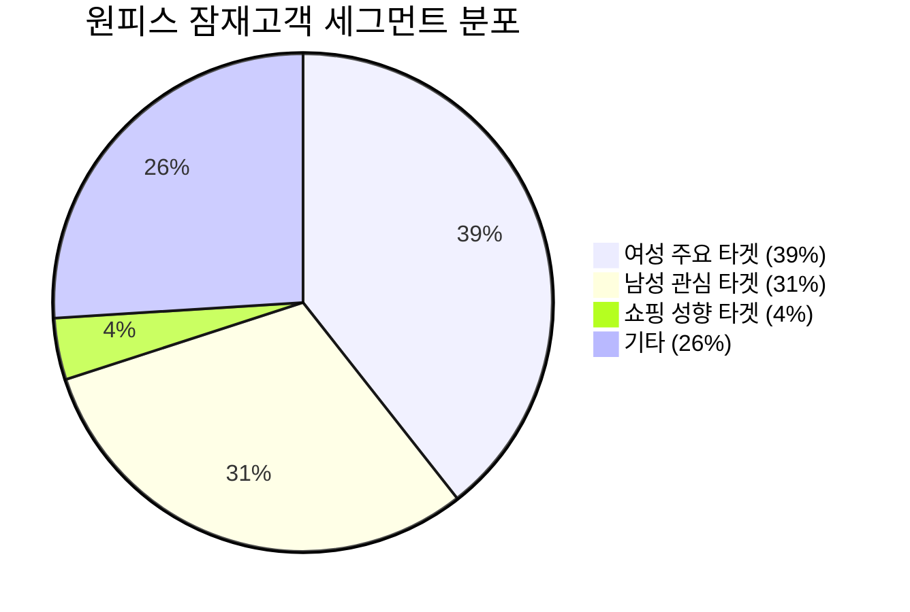
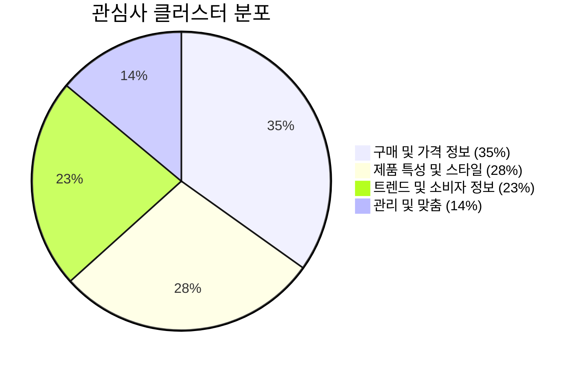
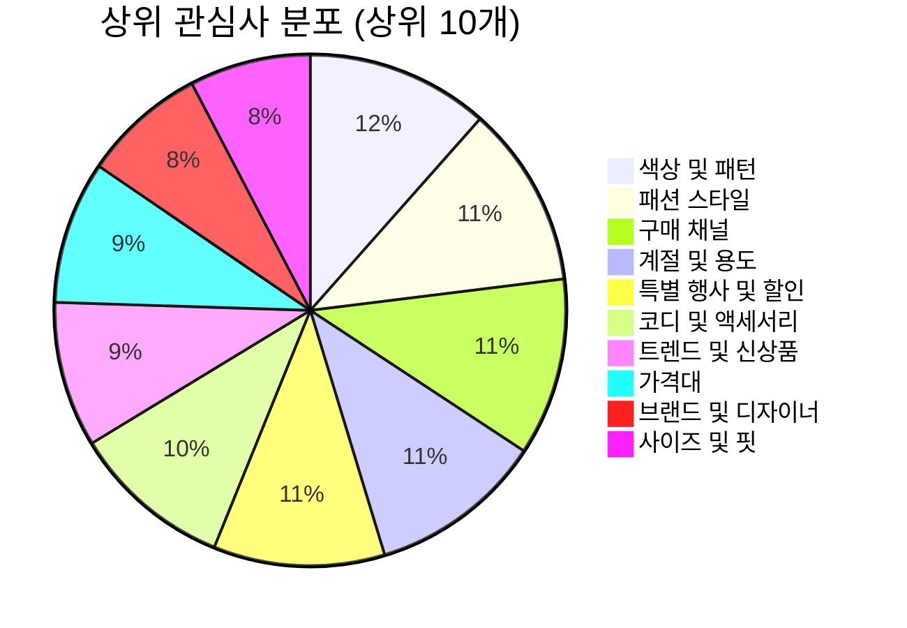
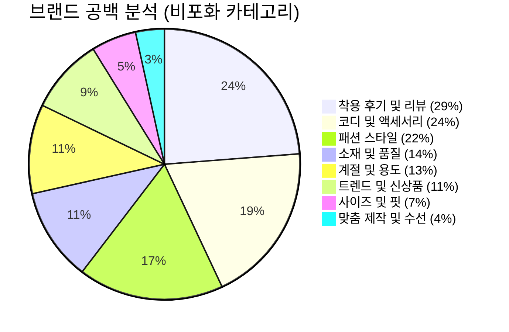

# 원피스 잠재고객 분석

> 출처: OneInsight 잠재고객 분석 대시보드
> 분석 대상: 원피스 잠재고객
> 전체 시장 규모: **3,750,000명**

---

## 경영진 요약

원피스 잠재고객은 약 375만 명으로, 주로 **여성 소비자**들이 원피스에 높은 관심을 보이지만 **남성 소비자**들 또한 상당한 비중으로 관련 제품에 흥미를 가지고 있습니다. 이는 원피스 카테고리가 다양한 성별의 소비자들에게 폭넓게 어필할 수 있는 잠재력을 가지고 있음을 시사합니다.

### 주요 내용

1. **여성 소비자들의 강한 관심**: '여성 원피스 주요 타겟'에서 명확하게 나타남
2. **남성 소비자들의 참여**: '남성 원피스 관심 및 관련 타겟'을 통해 확인 가능
3. **쇼핑 성향은 낮은 관심도**: 특정 쇼핑 행동 패턴보다는 원피스 자체에 대한 흥미가 우선
4. **성별을 아울러 다양한 소비자층에 매력적**: 남녀 모두에게서 나타나는 관심 분포는 잠재적으로 넓은 시장 기회 제공

---

## 사용자 세분화

### 1. 여성 원피스 주요 타겟

| 항목 | 내용 |
|------|------|
| **세그먼트 크기** | 1,477,504명 |
| **예상 연령대** | 20-60대 이상 여성 |
| **예상 성별 분포** | 남성 0% - 여성 100% |

**특징**: 다양한 연령대의 여성으로, 일상과 특별한 순간 모두에서 자신만의 스타일을 표현하기 위해 원피스에 큰 관심. 온라인 패션 커뮤니티에서 추천을 참고하거나, 신진 디자이너 브랜드와 가성비 좋은 브랜드를 탐색. 체형과 취향에 맞는 핏과 디자인 중시. 지속 가능한 패션과 해외 플랫폼, 명품 브랜드까지 폭넓게 정보 수집. 트렌드에 민감하게 반응.

**시장 세그먼트 구성**:
- 중년 여성 8.39%
- 20대 여성 8.36%
- 포멀 스타일 선호 여성 7.67%
- 대학생 여성 7.51%
- 직장인 여성 7.49%
- 30대 여성 6.72%
- 캐주얼 스타일 선호 여성 6.60%
- 여성복 쇼핑 선호자 6.60%
- 플러스 사이즈 여성 6.03%
- 패션에 관심 많은 여성 4.44%

**주요 관심사 TOP 10**:
1. 특별 행사 및 할인 (9.70%)
2. 착용 후기 및 리뷰 (9.26%)
3. 친환경 및 윤리적 소비 (8.58%)
4. 색상 및 패턴 (8.50%)
5. 가격대 (7.89%)
6. 코디 및 액세서리 (7.51%)
7. 계절 및 용도 (7.42%)
8. 패션 스타일 (7.00%)
9. 구매 채널 (6.49%)
10. 브랜드 및 디자이너 (6.44%)

**주요 토픽**:
- 패션 커뮤니티 추천 (75.92%)
- 지속 가능한 패션 브랜드 (68.24%)
- 해외 패션 플랫폼 (65.36%)
- 가격대별 추천 원피스 (60.67%)
- 키 작녀 원피스 코디 (59.40%)

---

### 2. 남성 원피스 관심 및 관련 타겟

| 항목 | 내용 |
|------|------|
| **세그먼트 크기** | 1,147,996명 |
| **예상 연령대** | 20대~60대 이상 남성 |
| **예상 성별 분포** | 남성 95% - 여성 5% |

**특징**: 다양한 연령대의 남성들이 패션 트렌드에 민감하게 반응하며, 온라인 커뮤니티와 SNS를 통해 새로운 스타일과 할인 정보를 적극적으로 탐색. 자신만의 개성을 표현할 수 있는 원피스를 찾기 위해 명품, 빈티지, 홈쇼핑 등 다양한 채널을 활용. 선물이나 특별한 날을 위한 제품 선택에도 신중. 디자인 변경이나 첫 구매 할인 등 맞춤형 서비스에도 높은 관심. 실용성과 스타일을 동시에 추구.

**시장 세그먼트 구성**:
- 신혼부부 남성 10.64%
- 트렌드에 민감한 남성 9.29%
- 20대 남성 8.79%
- 30대 남성 8.73%
- 40대 남성 8.25%
- 포멀 스타일 선호 남성 8.25%
- 직장인 남성 8.22%
- 플러스 사이즈 남성 8.08%
- 캐주얼 스타일 선호 남성 6.37%
- 남성복 쇼핑 선호자 0.81%

**주요 관심사 TOP 10**:
1. 사이즈 및 핏 (9.81%)
2. 트렌드 및 신상품 (8.83%)
3. 가격대 (8.53%)
4. 특별 행사 및 할인 (8.20%)
5. 코디 및 액세서리 (7.93%)
6. 색상 및 패턴 (7.64%)
7. 패션 스타일 (7.18%)
8. 브랜드 및 디자이너 (6.83%)
9. 계절 및 용도 (6.03%)
10. 구매 채널 (6.02%)

**주요 토픽**:
- 패션 커뮤니티 추천 (43.38%)
- 키덜트 상품 할인 (41.46%)
- 가격대별 추천 원피스 (37.94%)
- 선물용 원피스 가격 (37.59%)
- 해외 명품 원피스 구매 (33.56%)

---

### 3. 쇼핑 성향별 타겟

| 항목 | 내용 |
|------|------|
| **세그먼트 크기** | 150,861명 |
| **예상 연령대** | 20-39세 |
| **예상 성별 분포** | 남성 10% - 여성 90% |

**특징**: 트렌디한 패션을 빠르게 접하고 싶어 온라인 쇼핑몰과 라이브 커머스를 적극적으로 활용. 합리적인 가격과 다양한 할인, 포인트 적립 등 쇼핑 혜택을 꼼꼼히 비교. 브랜드 할인이나 첫 구매 이벤트를 놓치지 않음. 오프라인 매장도 방문해 직접 원피스의 소재와 핏을 확인하는 등, 온라인과 오프라인을 넘나드는 스마트한 쇼핑 습관.

**시장 세그먼트 구성**:
- 오프라인 쇼핑 선호자 54.96%
- 온라인 쇼핑 선호자 45.04%

**주요 관심사 TOP 9**:
1. 패션 스타일 (17.56%)
2. 색상 및 패턴 (15.16%)
3. 소재 및 품질 (14.31%)
4. 코디 및 액세서리 (11.59%)
5. 브랜드 및 디자이너 (7.82%)
6. 가격대 (6.04%)
7. 구매 채널 (5.32%)
8. 특별 행사 및 할인 (3.64%)
9. 맞춤 제작 및 수선 (데이터 미표시)

**주요 토픽**:
- 온라인 쇼핑몰 이용 (66.41%)
- 라이브 커머스 시청 (62.07%)
- 포인트 적립 혜택 (59.48%)
- 가격 대비 만족도 (57.57%)
- 네이버 쇼핑 라이브 (55.46%)

---

## 관심사 개요

| 클러스터 | 점유율 | 주요 내용 |
|----------|--------|-----------|
| **구매 및 가격 정보** | 34.86% | 다양한 구매 채널을 탐색하며, 가격대에 민감하게 반응하고, 특별 할인이나 프로모션 정보를 적극적으로 찾아 합리적인 소비 추구 |
| **제품 특성 및 스타일** | 28.46% | 스타일, 디자인, 소재의 질, 신체에 맞는 사이즈와 핏, 색상 및 패턴, 특정 브랜드나 디자이너 제품에 큰 관심 |
| **트렌드 및 소비자 정보** | 22.74% | 최신 유행과 신상품에 민감하게 반응하며, 특정 계절이나 용도에 맞는 제품을 선호. 다른 소비자의 착용 후기와 리뷰를 참고하고, 연령대별 선호도를 고려하며, 친환경 및 윤리적 소비에도 가치를 둠 |
| **관리 및 맞춤** | 13.94% | 원피스의 수명 연장과 최적의 착용감을 위해 세탁 및 관리 방법에 대한 정보를 중요하게 생각하며, 필요에 따라 맞춤 제작이나 수선 서비스에도 관심 |

---

## 관심 분야 분포 (상위 10개)

| 순위 | 관심사 | 비중 |
|------|--------|------|
| 1 | 색상 및 패턴 | 9.31% |
| 2 | 패션 스타일 | 9.27% |
| 3 | 구매 채널 | 9.06% |
| 4 | 계절 및 용도 | 8.90% |
| 5 | 특별 행사 및 할인 | 8.74% |
| 6 | 코디 및 액세서리 | 8.20% |
| 7 | 트렌드 및 신상품 | 7.42% |
| 8 | 가격대 | 7.28% |
| 9 | 브랜드 및 디자이너 | 6.30% |
| 10 | 사이즈 및 핏 | 6.18% |

---

## 브랜드 고려 사항

### 경쟁사 관련성 분석

| 브랜드 | 패션 스타일 | 코디 및 액세서리 | 소재 및 품질 | 구매 채널 | 가격대 | 세탁 및 관리 | 사이즈 및 핏 | 트렌드 및 신상품 | 계절 및 용도 | 착용 후기 | 연령대 | 친환경 | 색상 및 패턴 | 특별 행사 | 브랜드 및 디자이너 | 맞춤 제작 |
|--------|-----------|----------------|-------------|-----------|--------|-------------|-------------|---------------|-----------|-----------|--------|--------|-------------|-----------|---------------|-----------|
| 써스데이아일랜드 | 보통 | 보통 | 거의 없음 | 거의 없음 | 거의 없음 | 거의 없음 | 거의 없음 | 보통 | 보통 | 거의 없음 | 거의 없음 | 거의 없음 | 보통 | 거의 없음 | 보통 | 거의 없음 |
| 케네스레이디 | 강한 | 관련 없음 | 관련 없음 | 강한 | 강한 | 관련 없음 | 거의 없음 | 강한 | 거의 없음 | 관련 없음 | 관련 없음 | 관련 없음 | 보통 | 강한 | 강한 | 관련 없음 |
| 지컷 | 강한 | 관련 없음 | 관련 없음 | 거의 없음 | 강한 | 관련 없음 | 강한 | 강한 | 거의 없음 | 관련 없음 | 관련 없음 | 관련 없음 | 보통 | 보통 | 보통 | 관련 없음 |
| 모조에스핀 | 강한 | 거의 관련 없음 | 관련 없음 | 보통 | 강한 | 관련 없음 | 관련 없음 | 강한 | 보통 | 보통 | 관련 없음 | 관련 없음 | 강한 | 보통 | 거의 없음 | 거의 관련 없음 |
| 잇미샤 | 강한 | 보통 | 관련 없음 | 강한 | 보통 | 관련 없음 | 관련 없음 | 강한 | 관련 없음 | 보통 | 관련 없음 | 관련 없음 | 거의 없음 | 보통 | 강한 | 관련 없음 |
| 지고트 | 강한 | 보통 | 관련 없음 | 거의 없음 | 거의 없음 | 관련 없음 | 관련 없음 | 강한 | 거의 없음 | 관련 없음 | 관련 없음 | 관련 없음 | 강한 | 강한 | 강한 | 거의 없음 |
| 로엠 | 강한 | 보통 | 관련 없음 | 보통 | 보통 | 관련 없음 | 보통 | 강한 | 거의 없음 | 거의 없음 | 관련 없음 | 관련 없음 | 보통 | 보통 | 거의 없음 | 거의 없음 |
| 온앤온 | 강한 | 거의 관련 없음 | 관련 없음 | 보통 | 강한 | 관련 없음 | 보통 | 강한 | 거의 없음 | 관련 없음 | 관련 없음 | 관련 없음 | 강한 | 보통 | 보통 | 관련 없음 |

---

## 브랜드 공백 분석

### 비포화 카테고리 (기회 영역)

| 카테고리 | 비포화 정도 |
|----------|-------------|
| 착용 후기 및 리뷰 | 29.44% |
| 코디 및 액세서리 | 23.84% |
| 패션 스타일 | 21.52% |
| 소재 및 품질 | 13.77% |
| 계절 및 용도 | 13.20% |
| 트렌드 및 신상품 | 11.18% |
| 사이즈 및 핏 | 6.66% |
| 맞춤 제작 및 수선 | 4.26% |

### 과포화 카테고리 (경쟁 치열)
- 브랜드 및 디자이너 (-17.58%)
- 가격대 (-10.79%)
- 구매 채널 (-6.50%)
- 특별 행사 및 할인 (-4.47%)

---

## 채널 및 콘텐츠 참여도

### 채널 세부 정보 - 인기 콘텐츠

**메타**:
- 패션 트렌드 (1.90x)
- 애완동물 (1.82x)
- 건강 (1.49x)
- 패션 (1.48x)
- 정신 건강 (1.48x)

**앱 유형**:
- 쇼핑 앱 (1.90x)
- 온라인 쇼핑 앱 (1.82x)
- 투자 앱 (1.46x)
- 모바일 결제 앱 (1.36x)
- 소매 앱 (1.35x)

**틱톡**:
- DIY 공예 (1.80x)
- DIY 챌린지 (1.80x)
- 동물 (1.62x)
- 사운드 챌린지 (1.57x)
- 뷰티 팁 (1.54x)

**TV**:
- 어린이 만화 (1.63x)
- 애니메이션 코미디 (1.50x)
- 음식 (1.44x)
- SF 드라마 (1.43x)
- 클래식 (1.39x)

---

## 전략적 시사점

### 1. 타겟팅 전략
- **1차 타겟**: 여성 원피스 주요 타겟 (39%, 148만명)
- **2차 타겟**: 남성 원피스 관심 및 관련 타겟 (31%, 115만명)
- **3차 타겟**: 쇼핑 성향별 타겟 (4%, 15만명)

### 2. 제품 포지셔닝
- 여성 타겟: 지속 가능한 패션, 신진 디자이너 브랜드, 체형별 핏 맞춤
- 남성 타겟: 선물용, 키덜트/빈티지 명품, 맞춤 서비스
- 쇼핑 성향 타겟: 라이브 커머스, 할인/포인트 혜택

### 3. 마케팅 채널
- 패션 커뮤니티 협업
- 라이브 커머스 활용
- 인스타그램 패션 콘텐츠
- 틱톡 DIY/뷰티 콘텐츠

### 4. 메시징 전략
- "패션 커뮤니티 추천 원피스"
- "지속 가능한 패션 브랜드"
- "가격대별 맞춤 추천"
- "해외 패션 플랫폼 감성"
- "체형별 핏 정착 원피스"

### 5. 기회 영역
- 착용 후기 및 리뷰 콘텐츠 강화 (29.44% 비포화)
- 코디 및 액세서리 제안 확대 (23.84% 비포화)
- 소재 및 품질 차별화 (13.77% 비포화)
