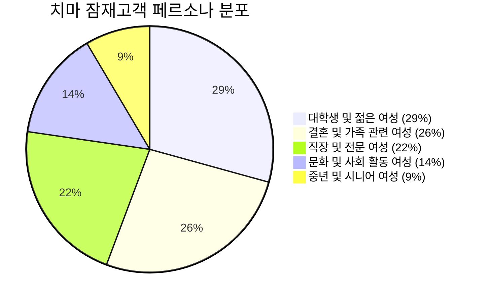
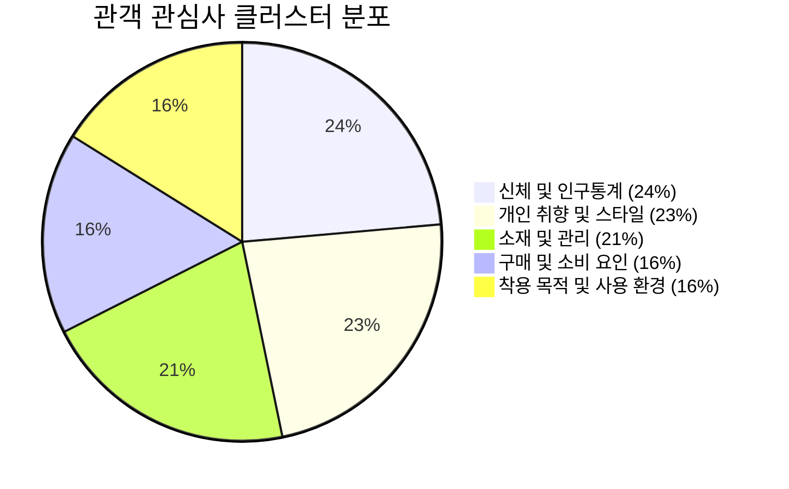
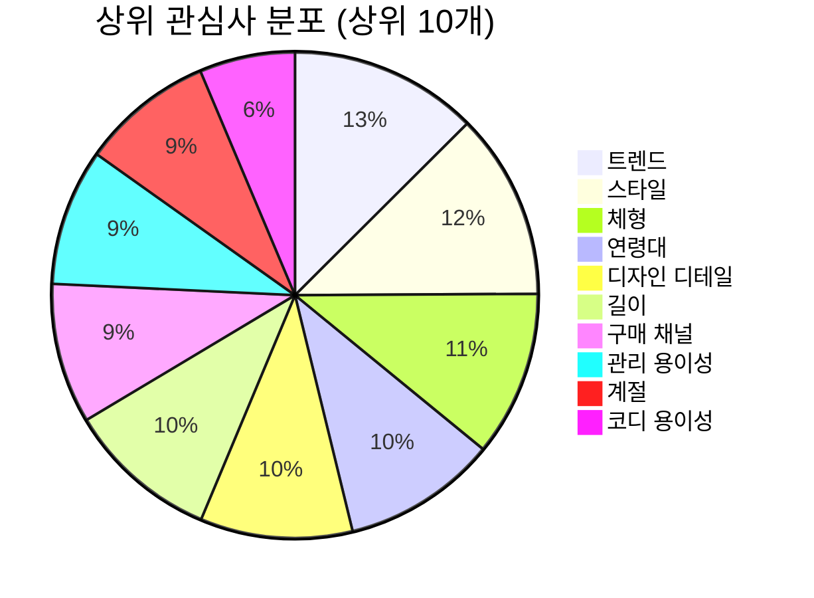
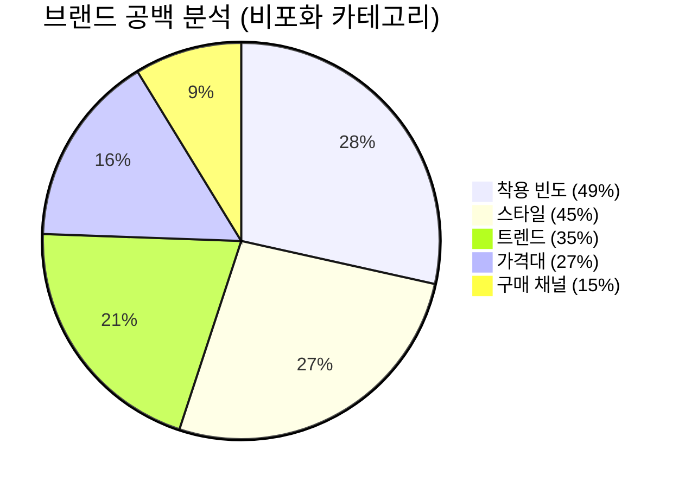

# 치마(스커트) 잠재고객 분석

> 출처: OneInsight 잠재고객 분석 대시보드
> 분석 대상: 치마 잠재고객
> 전체 시장 규모: **15,130,000명**

---

## 경영진 요약

'치마 잠재고객'은 주로 **대학생 및 젊은 여성**, **결혼 및 가족 관련 여성**, 그리고 **직장 및 전문 여성**으로 구성되어 있습니다. 이들은 전반적으로 활동적이며, 패션과 자기 표현에 높은 관심을 보이는 경향이 있습니다.

### 주요 통찰

1. **젊은 여성층의 높은 관심**: 대학생 및 젊은 여성 소비자들이 가장 높은 관심을 보이며, 패션 트렌드와 자기 관리, 그리고 사회 활동에 대한 강한 욕구 반영
2. **가족 중심 소비자의 중요성**: 결혼 및 가족 관련 여성 소비층 또한 상당한 관심을 나타내며, 실용적이면서도 스타일을 유지할 수 있는 패션 아이템에 대한 수요 존재
3. **직업적 역할과 패션의 연관성**: 직장 및 전문 여성 소비자들이 패션에 긍정적인 관심을 보이며, 전문적이고 세련된 이미지를 통해 업무 환경에서의 자신감을 표현하고자 하는 경향
4. **낮은 관심도의 중년 및 시니어 여성 대상 기회**: 상대적으로 낮은 관심도지만, 해당 연령대의 잠재 고객에게 어필할 수 있는 새로운 스타일이나 편안함을 강조한 제품 개발의 기회

---

## 페르소나 세분화

### 1. 대학생 및 젊은 여성

| 항목 | 내용 |
|------|------|
| **세그먼트 크기** | 4,428,684명 |
| **예상 연령대** | 19-27세 |
| **예상 성별 분포** | 남성 0% - 여성 100% |

**특징**: 일상 속에서 트렌디한 스커트 스타일을 즐기며, 다양한 핏과 소재를 활용해 자신만의 개성을 표현. 면접이나 중요한 자리에서는 세련된 롱 스커트 코디로 단정함을 더하고, 평소에는 운동화와 매치해 캐주얼하면서도 편안한 룩 선호. 해외 패션 플랫폼을 참고하며 최신 트렌드를 빠르게 반영.

**시장 세그먼트 구성**:
- 면접 준비 여성 52.71%
- 대학생 여성 37.96%
- 패션에 관심 있는 여성 9.33%

**주요 관심사 TOP 10**:
1. 트렌드 (8.38%)
2. 연령대 (8.34%)
3. 소재 (7.12%)
4. 길이 (6.87%)
5. 브랜드 선호도 (6.45%)
6. 구매 채널 (6.23%)
7. 체형 (6.12%)
8. 스타일 (5.68%)
9. 디자인 디테일 (5.22%)
10. 관리 용이성 (5.10%)

**주요 토픽**:
- 스커트 핏 트렌드 (57.12%)
- 시폰 소재가 하늘하늘해 (56.45%)
- 롱 스커트 트렌디 (54.22%)
- 스커트 캐주얼룩 (53.94%)
- 캐주얼 스커트 인기 (52.30%)

---

### 2. 결혼 및 가족 관련 여성

| 항목 | 내용 |
|------|------|
| **세그먼트 크기** | 3,995,991명 |
| **예상 연령대** | 25-40세 |
| **예상 성별 분포** | 남성 0% - 여성 100% |

**특징**: 결혼과 가족을 중심으로 한 삶을 살아가며, 특별한 날이나 일상 속에서 세련된 스커트 스타일을 즐김. 트렌디하면서도 실용적인 패션 추구. 지속 가능한 브랜드와 다양한 해외 패션 플랫폼을 탐색하며, 자신만의 개성을 살린 롱 스커트 코디와 오피스룩을 자연스럽게 소화. 임신이나 결혼 등 인생의 중요한 순간에도 편안함과 스타일을 모두 챙기는 감각적인 선택 선호.

**시장 세그먼트 구성**:
- 결혼식 하객 여성 40.78%
- 임산부 31.10%
- 신혼부부 여성 28.12%

**주요 관심사 TOP 10**:
1. 착용 목적 (6.89%)
2. 관리 용이성 (6.57%)
3. 디자인 디테일 (6.55%)
4. 길이 (6.45%)
5. 소재 (6.04%)
6. 체형 (5.56%)
5. 스타일 (5.52%)
8. 트렌드 (5.45%)
9. 구매 채널 (5.07%)
10. 브랜드 선호도 (4.89%)

**주요 토픽**:
- 지속 가능한 브랜드 (64.81%)
- 해외 패션 플랫폼 (61.28%)
- 체크 스커트 패션 (55.86%)
- 니트 롱 스커트 (54.42%)
- 시폰 소재가 하늘하늘해 (54.16%)

---

### 3. 직장 및 전문 여성

| 항목 | 내용 |
|------|------|
| **세그먼트 크기** | 3,264,282명 |
| **예상 연령대** | 25-45세 |
| **예상 성별 분포** | 남성 0% - 여성 100% |

**특징**: 다양한 직업 환경에서 세련된 이미지를 유지하기 위해 계절과 상황에 맞는 스커트 스타일을 적극적으로 탐색. 오피스룩부터 하객룩, 데이트룩까지 다양한 스타일을 소화하며, 트렌디한 패션 감각과 실용성을 동시에 추구. 특별한 행사나 일상 속에서도 자신만의 페미닌한 매력을 드러내는 데 관심이 많아, 연예인 패션이나 시즌별 추천 아이템에도 꾸준히 주목.

**시장 세그먼트 구성**:
- 여성 강사 44.89%
- 교사 여성 21.86%
- 공무원 여성 16.58%
- 여성 창업가 7.47%
- 여성 경영인 6.47%
- 직장인 여성 2.73%

**주요 관심사 TOP 10**:
1. 디자인 디테일 (10.52%)
2. 착용 목적 (10.20%)
3. 특별한 기능 (8.29%)
4. 구매 채널 (6.59%)
5. 길이 (6.37%)
6. 계절 (6.27%)
7. 트렌드 (5.02%)
8. 체형 (4.82%)
9. 스타일 (4.62%)
10. 연령대 (4.40%)

**주요 토픽**:
- 스커트 오피스룩 (74.96%)
- 스커트 데이트룩 (66.51%)
- 대학생 데이트룩 추천치마 (64.03%)
- 스커트 페미닌룩 (61.80%)
- 봄 오피스 치마 정장 (54.44%)

---

### 4. 문화 및 사회 활동 여성

| 항목 | 내용 |
|------|------|
| **세그먼트 크기** | 2,153,093명 |
| **예상 연령대** | 28-45세 |
| **예상 성별 분포** | 남성 0% - 여성 100% |

**특징**: 다양한 문화 행사와 예술 전시에 적극적으로 참여하며, 세련된 패션 감각을 바탕으로 실크와 니트 소재의 스커트 스타일링을 즐김. 잡지에서 본 아이템을 직접 쇼룸에서 체험하거나, 사회적 기업 제품을 구매하며 기부 문화에도 관심. 동호회 활동이나 가족과의 시간에도 키즈 스커트 등 다양한 패션 아이템을 활용해 자신만의 개성을 표현.

**시장 세그먼트 구성**:
- 여성 사회 활동가 40.66%
- 여성 예술가 32.26%
- 여성 동호회 회원 20.07%
- 문화 행사 참석 여성 7.01%

**주요 관심사 TOP 10**:
1. 브랜드 선호도 (9.83%)
2. 연령대 (8.49%)
3. 활동성 (8.44%)
4. 스타일 (8.38%)
5. 길이 (7.17%)
6. 디자인 디테일 (7.13%)
7. 윤리적 소비 (6.44%)
8. 체형 (6.09%)
9. 구매 채널 (6.09%)
10. 트렌드 (5.73%)

**주요 토픽**:
- 쇼룸 직접 체험 (56.32%)
- 기부 문화 활성화 (45.10%)
- 잡지 속 아이템 구매 (44.17%)
- 스커트 구매 후기 (43.68%)
- 스커트 레이어드 패션 (42.23%)

---

### 5. 중년 및 시니어 여성

| 항목 | 내용 |
|------|------|
| **세그먼트 크기** | 1,287,950명 |
| **예상 연령대** | 45-70세 |
| **예상 성별 분포** | 남성 0% - 여성 100% |

**특징**: 일상에서 편안함과 세련됨을 동시에 추구하며, 계절에 맞는 다양한 스타일의 치마를 활용해 자신만의 멋을 표현. 오피스룩부터 데일리 캐주얼, 특별한 날의 데이트룩까지 상황에 따라 밴딩이나 니트, 데님 등 다양한 소재와 디자인을 즐겨 선택. 한 달에 한두 번은 친구들과의 모임이나 가족 행사에서 여성스러운 레이스나 롱 스커트로 우아함을 더하며, 전통적인 감각과 현대적인 감각을 자연스럽게 조화.

**시장 세그먼트 구성**:
- 시니어 여성 49.27%
- 중년 여성 45.92%
- 전통 의상에 관심 있는 여성 4.80%

**주요 관심사 TOP 10**:
1. 구매 채널 (11.24%)
2. 색상 (9.75%)
3. 착용 목적 (9.75%)
4. 체형 (9.18%)
5. 스타일 (6.95%)
6. 길이 (6.84%)
7. 디자인 디테일 (6.83%)
8. 트렌드 (6.43%)
9. 연령대 (6.08%)
10. 계절 (4.57%)

**주요 토픽**:
- 가을 오피스룩 치마 (77.64%)
- 데일리 캐주얼 밴딩 치마 (74.43%)
- 데님 스커트 스타일 (57.76%)
- 밴딩 스커트 구매 (51.25%)
- 데님 스커트 캐주얼 (50.75%)

---

## 관심사 개요

| 클러스터 | 점유율 | 주요 내용 |
|----------|--------|-----------|
| **신체 및 인구통계** | 23.60% | 다양한 연령대의 잠재 고객들은 자신의 체형에 맞는 사이즈와 길이를 찾으며, 이들이 선호하는 치마 스타일은 연령대별로 다르게 나타날 수 있음 |
| **개인 취향 및 스타일** | 23.16% | 트렌디하거나 클래식한 스타일 중 자신의 개성을 표현할 수 있는 디자인을 선호하며, 특정 브랜드나 색상, 섬세한 디자인 디테일에 주목. 코디 용이성도 중요한 선택 기준 |
| **소재 및 관리** | 20.77% | 치마 구매 시 소재의 종류와 착용감을 중요하게 생각하며, 세탁 및 보관이 편리한 관리 용이성 또한 구매 결정에 큰 영향 |
| **구매 및 소비 요인** | 16.34% | 합리적인 가격대를 고려하며 온라인 또는 오프라인 등 선호하는 구매 채널을 통해 치마를 구매. 최근에는 윤리적 소비를 중시하는 경향도 나타남 |
| **착용 목적 및 사용 환경** | 16.12% | 일상복, 오피스룩, 특별한 날 등 다양한 상황에서 치마를 착용하며, 계절과 활동성에 따라 적절한 기능성을 중요하게 생각 |

---

## 관심사 분포 (상위 10개)

| 순위 | 관심사 | 비중 |
|------|--------|------|
| 1 | 트렌드 | 8.37% |
| 2 | 스타일 | 8.27% |
| 3 | 체형 | 7.35% |
| 4 | 연령대 | 6.86% |
| 5 | 디자인 디테일 | 6.77% |
| 6 | 길이 | 6.75% |
| 7 | 구매 채널 | 6.23% |
| 8 | 관리 용이성 | 6.07% |
| 9 | 계절 | 5.88% |
| 10 | 코디 용이성 | 4.25% |

---

## 브랜드 고려 사항

### 경쟁사 관련성 분석

| 브랜드 | 스타일 | 착용 목적 | 소재 | 관리 용이성 | 계절 | 브랜드 선호도 | 가격대 | 구매 채널 | 착용 빈도 |
|--------|--------|-----------|------|-------------|--------|--------------|--------|-----------|-----------|
| 트리밍버드 | 낮음 | 낮음 | 낮음 | 낮음 | 낮음 | 낮음 | 낮음 | 낮음 | 낮음 |
| 쓰리타임즈 | 보통 | 보통 | 낮음 | 낮음 | 보통 | 보통 | 보통 | 보통 | 낮음 |
| 기준 | 강한 | 낮음 | 낮음 | 강한 | 낮음 | 낮음 | 낮음 | 강한 | 낮음 |
| 선번프로젝트 | 낮음 | 보통 | 보통 | 강한 | 낮음 | 보통 | 낮음 | 보통 | 강한 |
| 인스턴트펑크 | 강한 | 강한 | 낮음 | 낮음 | 낮음 | 낮음 | 낮음 | 낮음 | 강한 |
| 그로브 | 보통 | 낮음 | 낮음 | 강한 | 낮음 | 강한 | 낮음 | 보통 | 낮음 |
| 르아브르 | 낮음 | 낮음 | 낮음 | 낮음 | 낮음 | 낮음 | 낮음 | 낮음 | 낮음 |
| 딘트 | 낮음 | 낮음 | 낮음 | 강한 | 낮음 | 낮음 | 보통 | 강한 | 보통 |

---

## 브랜드 공백 분석

### 비포화 카테고리 (기회 영역)

| 카테고리 | 비포화 정도 |
|----------|-------------|
| 착용 빈도 | 48.67% |
| 스타일 | 45.38% |
| 트렌드 | 35.06% |
| 가격대 | 26.82% |
| 구매 채널 | 14.93% |

### 과포화 카테고리 (경쟁 치열)

> 과포화 카테고리 상세는 `competitive-analysis-skirt.md` 참조

---

## 채널 및 콘텐츠 참여도

### 채널 세부 정보 - 인기 콘텐츠

**유튜브**:
- 패션 트렌드 (2.40x)
- DIY 해킹 (2.11x)
- 스케치 코미디 (1.85x)
- 뷰티 (1.63x)
- 라이프스타일 (1.36x)

**오픈 웹**:
- 패션 (2.00x)
- 네트워킹 (1.69x)
- 운영 (1.68x)
- 정치 (1.57x)
- 취미 (1.56x)

**TV**:
- 미스터리 (1.83x)
- 시리즈 (1.59x)
- 예술 (1.51x)
- 판타지 드라마 (1.50x)
- 박스 세트 (1.47x)

**틱톡**:
- 동물 (1.74x)
- 음식 (1.65x)
- 장난 (1.62x)
- 라이브 쇼핑 (1.42x)
- 브이로그 (1.41x)

---

## 전략적 시사점

### 1. 타겟팅 전략
- **1차 타겟**: 대학생 및 젊은 여성 (29%, 443만명)
- **2차 타겟**: 결혼 및 가족 관련 여성 (26%, 400만명)
- **3차 타겟**: 직장 및 전문 여성 (22%, 326만명)

### 2. 제품 포지셔닝
- 연령대별로 다른 스타일 제안: 젊은 층은 트렌디한 캐주얼, 직장인은 오피스룩, 중장년층은 편안한 밴딩/니트 소재
- 해외 패션 플랫폼 트렌드 반영
- 시폰/니트/데님 등 다양한 소재 활용

### 3. 마케팅 채널
- 유튜브 패션 트렌드 콘텐츠
- 오픈 웹 패션 플랫폼
- 틱톡 라이브 쇼핑

### 4. 메시징 전략
- "트렌디하면서도 실용적인 스커트"
- "오피스룩부터 데이트룩까지"
- "해외 패션 감각의 롱 스커트"
- "편안함과 스타일을 모두 갖춘 치마"

---

## 연관 문서

- [[bodybar-potential-customers](/research/bodybar-potential-customers.md)] — 바디바 잠재고객 분석
- [[onesie-potential-customers](/research/onesie-potential-customers.md)] — 원피스 잠재고객 분석
- [[skirt-market-research](/research/skirt-market-research.md)] — 치마 시장조사 종합 보고서
- [[skirt-time-place-space-passion-worksheet](/branding/skirt-time-place-space-passion-worksheet.md)] — 치마 TPSP 워크시트
- [[skirt-bmc-9blocks](/research/skirt-bmc-9blocks.md)] — 치마 BMC (9블록)
